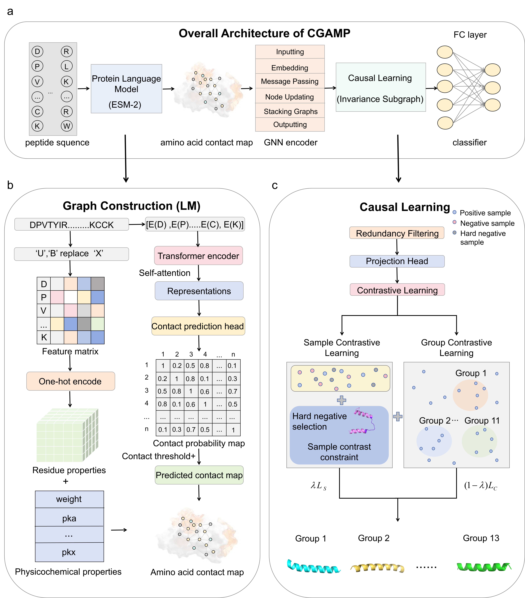

~~>📋  A  README.md for code accompanying our paper CGAMP

# Graph-Based Causal Learning and Protein Language Models for Multi-Class Prediction of Antimicrobial Peptides



## CGAMP Webserver <a href="http://CGAMP.ahbd.net/" target="_blank"></a>

Exciting news🔥 The CGAMP webserver is now online! Explore advanced predictions for antimicrobial peptides, supporting both binary and multi-class classification, at [CGAMP Webserver](http://CGAMP.ahbd.net/).

_Start your exploration today — the discovery of novel antimicrobial peptides (AMPs) and their activity prediction 🧬🔍 could be efficiently accelerated with only a few clicks!_


## Local Environment Setup for Running the Test

First, download the repository and create the environment.<br>

### Create an Environment with Conda
requirement
```bash
git clone https://github.com/klyLab/CGAMP.git
cd ./CGAMP
conda env create -f ./environment.yml
```

### Download Datasets

We provide the raw amino acid sequences in FASTA format for both binary classification and multi-class classification tasks.The datasets include benchmark sets (for model training) and independent test sets (for model evaluation).

#### Binary classification datasets
- [Binary classification benchmark dataset](https://drive.google.com/file/d/1tr8Ct15LbbMuiEqfWx6B7rREg4tu8_NF/view?usp=sharing)
- [Binary classification independent test dataset](https://drive.google.com/file/d/15-bVYhVDDW3yMMCmxHI_Num9Tfw3hFfV/view?usp=drive_link).<br>

#### Multi-class classification datasets
- [Multi-class classification benchmark dataset](https://drive.google.com/file/d/1oO3tno3dFAFrqeXjJR3dUWphrpqPasIF/view?usp=drive_link)
- [Multi-class classification independent test dataset](https://drive.google.com/file/d/18Tgbn9Dsu3dOAOOIpdQL3VShVA_EjLys/view?usp=drive_link).<br>


## Usage
Put all the downloaded dataset files into the same folder.  
We recommend creating `./raw_data` in the project root directory and placing all FASTA files there.

Convert FASTA to Protein Graph
Before running predictions or testing, you need to convert FASTA sequences into graph-structured .pt files.
```bash
#Demo 1: Binary classification positive sample (label=1):
python data_processing.py \
  --fasta_dir ./raw_data \
  --fasta_filename binary_benchmark_pos.fasta \
  --label 1 \
  --save_dir ./data_processed # Output: binary_benchmark_pos.pt
```
```bash
# Demo 2: Binary classification negative sample (label=0):
python data_processing.py \
  --fasta_dir ./raw_data \
  --fasta_filename binary_benchmark_neg.fasta \
  --label 0 \
  --save_dir ./data_processed  # Output: binary_benchmark_neg.pt
```
When converting FASTA files to .pt format, correct label IDs must be assigned to each functional category for multi-class tasks (see the mapping relationship below). 
Mismatched labels do not affect program execution, but strict adherence to the mapping allows direct use of pre-trained models without retraining.
| Category (Antimicrobial Function) | Label ID |
|-----------------------------------|----------|
| antibacterial                     | 0        |
| anticancer                        | 1        |
| antimammalian                     | 2        |
| anticandida                       | 3        |
| antifungal                        | 4        |
| antigram-negative                 | 5        |
| antigram-positive                 | 6        |
| antihiv                           | 7        |
| antiviral                         | 8        |
| anurandefense                     | 9        |
| hemolytic                         | 10       |

```bash
#Demo 1: Muliti-class classification (antibacterial):
python data_processing.py \
  --fasta_dir ./raw_data \
  --fasta_filename antibacterial.fasta \
  --label 0 \
  --save_dir ./data_processed
```
```bash
#Demo 2: Muliti-class classification (anticancer):
python data_processing.py \
  --fasta_dir ./raw_data \
  --fasta_filename anticancer.fasta \
  --label 1 \
  --save_dir ./data_processed
```

Merge Processed Protein Graph (.pt) Files
After converting all FASTA files to .pt, use combined_data_processing.py to merge category-specific .pt files into a single file for model input.
```bash
# Merge binary benchmark positive and negative .pt files:
python combined_data_processing.py \
  --task binary \
  --pos_pt_path ./data_processed/binary_benchmark_pos.pt \
  --neg_pt_path ./data_processed/binary_benchmark_neg.pt \
  --merged_save_path ./data_processed/binary_benchmark_merged.pt
```

```bash
# Merge Multi-class benchmark .pt files:
python combined_data_processing.py \
  --task multi \
  --multi_pt_paths ./data_processed/antibacterial_benchmark.pt \
                   ./data_processed/anticancer_benchmark.pt \
                   ./data_processed/antimammalian_benchmark.pt \
                   ./data_processed/anticandida_benchmark.pt \
                   ./data_processed/antifungal_benchmark.pt \
                   ./data_processed/antigram-negative_benchmark.pt \
                   ./data_processed/antigram-positive_benchmark.pt \
                   ./data_processed/antihiv_benchmark.pt \
                   ./data_processed/antiviral_benchmark.pt \
                   ./data_processed/anurandefense_benchmark.pt \
                   ./data_processed/hemolytic_benchmark.pt \
  --merged_save_path ./data_processed/multi_benchmark_merged.pt
```

Demo of CGAMP on binary classification:
```bash
# Predict
python binary_prediction.py

# Test
python binary_test.py
```

Demo of CGAMP on multi-class classification:
```bash
# Predict
python multi_prediction.py

# Test
python multi_test.py
```

## Download trained predictive models
We provide pre-trained model files for the two-stage antimicrobial peptide classification task. You can directly load these models in the testing code (`test.py`) to evaluate their performance without retraining. 
Alternatively, you can retrain your own models using the provided scripts.

### Binary classification model 
- [Antimicrobial Peptide Binary Classifier](https://drive.google.com/file/d/1uKD02f6WnHJ5SliakbSiYb8dC07I5TCD/view?usp=sharing).<br>

### Multi-class classification model 
- [Antimicrobial Peptide Multi-class Classifier](https://drive.google.com/file/d/1ZzXc5aqXXvtilHDZSLr32dY8YiXSpbZe/view?usp=drive_link).<br>


## Citations <a name="citations"></a>

If you find the models useful in your research, please kindly cite our paper:

```bibtex
@article{kang2025cgamp,
  title={Graph-Based Causal Learning and Protein Language Models for Multi-Class Prediction of Antimicrobial Peptides},
  author={Kang, Leyao and Wang, Huiying and Cai, Mengjie and Wu, Chuya and Wang, Bo and Yue, Zhenyu},
  year={2025},
  note={Manuscript in preparation}
}
```

## Contact <a name="contact"></a>
If you have any questions or suggestions regarding this work, please feel free to contact us:
- Kang Leyao: [kangleyao@stu.ahau.edu.cn](mailto:kangleyao@stu.ahau.edu.cn)  
- Yue Zhenyu: [zhenyuyue@ahau.edu.cn](mailto:zhenyuyue@ahau.edu.cn)